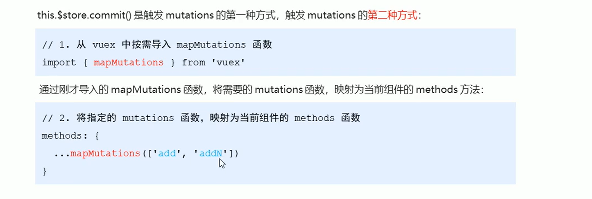
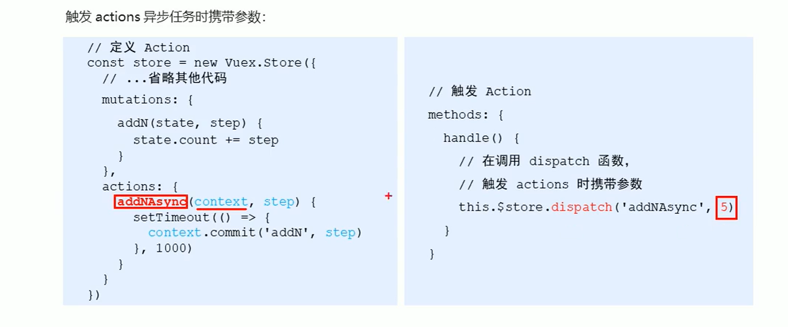
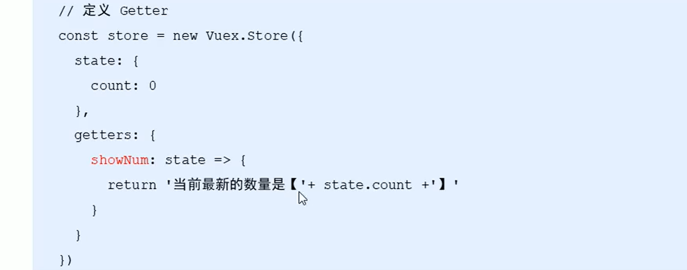
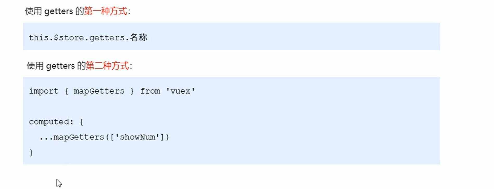

## Vuex的核心概述
Vuex的主要核心概念如下：
- State
- Mutation
- Action
- Getter

### 1. state
State提供唯一的公共数据源，所有共享的数据都要统一放到Store的State中进行存储。
```JavaScript
// 创建store数据源，提供唯一公共数据
const store = new Vuex.Store({
  state: { count: 0 }
})
```
组件访问State中的数据：
```JavaScript
/* 第一种方式。this.$store.state.全局数据名称,如： */
console.log(this.$store.state.count) // 0

/* 第二种方式。 */
// 1. 从 vuex 中按需导入 mapState 函数
// 2. 通过 mapState 函数，将当前组件需要的全局数据，映射为当前组件的 computed 计算属性：
import { mapState } from "vuex"
// ...code...
computed: {
  ...mapState(["count"])
}

console.log(this.count) // 0

```
### 2. Mutation
Mutation 用于变更 Store 中的数据:
- **只能**通过 mutation 变更 Store 数据，以便于集中监控数据变化
- 使用方式：

```JavaScript
export default {
  methods: {
    click() {
      this.add() // 调用获取到的 add 函数
    }
  }
}
```

### 3. Action
Action 用于处理异步任务
- 如果通过异步操作变更数据， 必须通过Action, 而不能使用 Mutation, 但是在 Action 中还是要通过触发 Mutation 的方式间接变更数据
- 同样的，可以用 this.$store.dispatch() 触发 action, 也可以通过 mapAction


### 4. Getter
Getter 用于对 Store 中的数据进行加工处理成新的数据
- Getter 可对 Store 中的数据处理之后形成新的数据，类似 Vue 的计算属性
- Store 中的数据发生变化，Getter 的数据也会跟着变化

